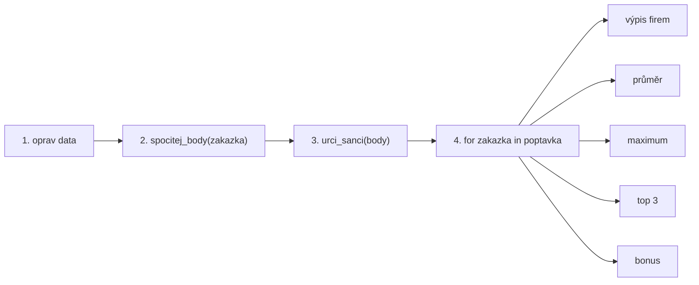

---
#== Layout
theme: default
background: https://cover.sli.dev # https://unsplash.com/collections/94734566/slidev
transition: slide-left #https://sli.dev/guide/animations#slide-transitions
mdc: true # https://sli.dev/guide/syntax#mdc-syntax
selectable: false
codeCopy: false
download: true
hideInToc: true

#== Code Highlighter
highlighter: shiki
lineNumbers: true

#== Dravings https://sli.dev/guide/drawing
drawings:
  persist: false

#== Export Configuration
# use export CLI options in camelCase format https://sli.dev/guide/exporting.html
export:
  format: pdf
  timeout: 30000
  dark: false
  withClicks: false

#== Slide Info
src: '../../pages/index.md'
title: "01 Co umím z PVA1 – zpětná vazba"
exportFilename: "01_co_umim_z_pva1"
titleTemplate: "PVA2 %s by Adam Fišer"
info: |
  ## PVA2 Programování a vývoj aplikací

  Zpětná vazba ke vstupnímu cvičení „Co umím z PVA1“.

  Určeno pouze pro výukové účely

  Created by [Adam Fišer](https://github.com/AdamFiser)
---
layout: default
---

# Obsah

<Toc :columns="2" minDepth="1" maxDepth="1"></Toc>

---

# Jak to dopadlo

- Cvičení **nebylo na známky** – je to mapa, podle které plánujeme další hodiny.
- Ukázky kódu jsou **anonymní**. Nejde o to, kdo co napsal, ale co se z toho naučíme všichni.

<div class="grid grid-cols-4 gap-4 mt-8 text-center">
  <div class="border rounded-lg p-4"><div class="text-4xl font-bold">10 / 15</div><div class="opacity-75 text-sm mt-2">odevzdalo řešení</div></div>
  <div class="border rounded-lg p-4"><div class="text-4xl font-bold">3 / 10</div><div class="opacity-75 text-sm mt-2">programů doběhlo bez chyby</div></div>
  <div class="border rounded-lg p-4"><div class="text-4xl font-bold">5 / 23</div><div class="opacity-75 text-sm mt-2">nejvyšší skóre</div></div>
  <div class="border rounded-lg p-4"><div class="text-4xl font-bold">0</div><div class="opacity-75 text-sm mt-2">řešení s cyklem <code>for</code></div></div>
</div>

<v-click>

<div class="mt-8 text-xl">

👉 Hledat chyby umíte. **Napsat program, který data zpracuje, zatím ne.** To je to, na čem začneme stavět.

</div>

</v-click>

<!--
15 žáků v rosteru, 12 přijalo zadání, 10 něco odevzdalo. Dva přijali, ale nic nepushnuli, tři zadání vůbec nepřijali.
Skóre: 5, 4, 1, 1, 1 a pětkrát 0 z 23.
-->

---
zoom: 0.8
---

# Co kontroloval autograder

| Úkol | Kontrola | Splnilo |
|---|---|:---:|
| 1 – Data | program doběhne bez chyby | **3** / 10 |
| | obraty C, E, I opravené na čísla | 1 / 10 |
| | překlep `autmotive` a klíč `newslteer` opravené v datech | 1 / 10 |
| | aspoň 5 komentářů `# OPRAVA:` | 2 / 10 |
| 2 – Body | funkce vrací správné body | 0 / 10 |
| 3 – Šance | funkce vrací `malá` / `střední` / `vysoká` | 0 / 10 |
| 4 – Výstupy | výpis, průměr, maximum, top 3, bonus | 0 / 10 |
| Techniky | slovník nebo `in` pro kritéria | 1 / 10 |
| | výchozí hodnota (`.get(…, False)` / `param=False`) | 1 / 10 |
| | `for`, `sorted(key=…)`, f-string | 0 / 10 |

<!--
Pozor: chyby v datech jste NAŠLI skoro všichni (viz další slajd), ale opravili jste je jen v komentáři.
-->

---
layout: cover
background: https://cover.sli.dev
---

# Silné stránky

---

# Co vám jde 💪

<v-clicks>

- **Pečlivé čtení dat.** 7 z 10 našlo obraty zapsané jako text (`"5"`, `"20"`, `"100"`), většina i překlepy `autmotive` a `newslteer`.
- **Komentujete, co děláte.** Skoro všichni popsali své opravy – přesně to zadání chtělo.
- **Znáte `def` a výchozí parametry.** Několik z vás napsalo hlavičku jako `def spocitej_body(zakazka, konference=False, newsletter=False)`.
- **Umíte zapsat podmínky.** Jedno řešení mělo bodování úplně správně – včetně rozsahu a testu členství:

</v-clicks>

<v-click>

```python
if obratA > 1000:
    skoreA += 1
elif 10 <= obratA <= 1000:      # zřetězené porovnání ✔
    skoreA += 3
if zemeA in ("CZ", "SK"):       # test členství v n-tici ✔
    skoreA += 2
elif zemeA in ("DE", "FR"):
    skoreA += 1
```

</v-click>

<!--
Tohle je z řešení, které mělo nejvíc bodů. Logika je správně, chybí jen funkce a cyklus – viz dál.
-->

---
layout: cover
background: https://cover.sli.dev
---

# Slabé stránky
## a na co se zaměřit

---

# 1. Program musí doběhnout

4 z 10 programů skončily **chybou syntaxe** – takový program se nespustí vůbec, ani jeho hotová část.

<div class="grid grid-cols-2 gap-4">
<div>

```python
print body       # print je funkce: print(body)
```

```python
if body = 9-10   # = místo ==, chybí :
print ("Vaše šance je vysoká")
```

```python
odvetvi =        # nedokončený příkaz
```

```python
if firma["odvetvi"] == "automotive":
# prázdné tělo bloku → IndentationError
```

</div>
<div>

<v-clicks>

- **Spouštějte program často** – po každých pár řádcích, ne až na konci.
- Čtěte `Traceback` odspodu: poslední řádek říká **co**, číslo řádku **kde**.
- Nedokončený blok uzavřete `pass` a připište plán do komentáře:

</v-clicks>

<v-click>

```python
def urci_sanci(body):
    # TODO: 9–10 vysoká, 5–8 střední, jinak malá
    pass
```

</v-click>

</div>
</div>

---

# 2. Opravte data tam, kde jsou

Chyby jste našli, ale opravili je jen v komentáři – nebo jste pod seznam vložili opravenou kopii, která **nic nedělá**.

<div class="grid grid-cols-2 gap-4">
<div>

❌ Kopie pod seznamem – výraz se vyhodnotí a zahodí

```python
### Níže napište svůj kód ###
{"nazev": "Firma C", ..., "obrat": 5, ...}
# OPRAVA: Změna "5" na číslo 5
```

❌ Jen komentář, data zůstala stejná

```python
# OPRAVA firma C "obrat":"5" - "obrat":5
```

</div>
<div>

✅ Oprava přímo v seznamu `poptavka`

```python
{"nazev": "Firma C", ...,
 "obrat": 5, ...},  # OPRAVA: "5" → 5
```

<v-click>

Proč na tom záleží? Neopravená data shodí výpočet:

```python
"5" > 1000
# TypeError: '>' not supported between
#            instances of 'str' and 'int'
```

</v-click>

<v-click>

⚠️ Pozor i na **mazání** – v jednom řešení zmizel celý řádek `Firma M`.

</v-click>

</div>
</div>

---

# 3. Data už máte – nepoužívejte `input()`

Tři řešení se ptala uživatele na odvětví, obrat nebo zemi. Zadání ale data **dává** v seznamu `poptavka`.

<div class="grid grid-cols-2 gap-4">
<div>

❌

```python
def vypocet_bodu(poptavka):
    firma = int(input("napiš mi název firmy:"))
    ...
```

- `int("Firma A")` → `ValueError`
- autograder (ani nikdo jiný) nic nenapíše → `EOFError`
- parametr `poptavka` se vůbec nepoužije

</div>
<div>

✅ Funkce dostane data parametrem a projde je cyklem

```python
def spocitej_body(zakazka):
    ...
    return body

for zakazka in poptavka:
    print(spocitej_body(zakazka))
```

</div>
</div>

<v-click>

<div class="mt-4">

💡 **Pravidlo:** `input()` jen tehdy, když zadání výslovně chce, aby data psal uživatel.

</div>

</v-click>

---

# 4. Funkce: parametr dovnitř, `return` ven

<div class="grid grid-cols-2 gap-4">
<div>

❌ `print` místo `return`, chybí `return`

```python
def sance_na_zakazku(body):
    if body > 10:
        print("Vysoká šance na zakázku")
    ...

def spocitej_body(zakazka, ...):
    body = 0
    ...
    # funkce skončí → vrátí None
```

❌ Funkce bez parametru

```python
def pocitadlo_na_body():
    konference = int(input(...))
    ...
```

</div>
<div>

✅

```python
def urci_sanci(body: int) -> str:
    if body >= 9:
        return "vysoká"
    if body >= 5:
        return "střední"
    return "malá"

sance = urci_sanci(7)    # hodnotu můžu dál použít
print(sance)             # střední
```

<v-clicks>

- Výsledek z `print` **nejde** uložit, sečíst ani seřadit.
- Funkce, která vrací, se dá použít v úkolech 4.1–4.4 i v bonusu.

</v-clicks>

</div>
</div>

---

# 5. Slovník: hranaté závorky a `.get()`

<div class="grid grid-cols-2 gap-4">
<div>

❌

```python
odvetvi = zakazka("odvetvi")
# TypeError: 'dict' object is not callable
```

❌ Chybějící klíč

```python
zakazka["newsletter"]   # Firma O má "newslteer"
# KeyError: 'newsletter'
```

</div>
<div>

✅

```python
# povinný klíč – musí existovat
odvetvi = zakazka["odvetvi"]
# nepovinný klíč – když chybí, vrátí False
konference = zakazka.get("konference", False)
```

<v-click>

✅ Slovník místo řady `if`

```python
BODY_ODVETVI = {"automotive": 3, "retail": 2}
body = BODY_ODVETVI.get(zakazka["odvetvi"], 0)
```

</v-click>

</div>
</div>

<v-click>

⚠️ `.get()` chybu v datech **neopraví, jen schová**: s klíčem `newslteer` dostane Firma O 6 bodů místo 7. Proto úkol 1.

</v-click>

---
zoom: 0.92
---

# 6. Pasti v podmínkách

<div class="grid grid-cols-2 gap-x-6 gap-y-2">
<div>

❌ Dva řetězce vedle sebe se **spojí**

```python
if zeme == "CZ" "SK":     # == "CZSK" → vždy False
```

❌ Číslo se rovná n-tici? Nikdy.

```python
if body == (0, 1, 2, 3, 4):   # vždy False
```

❌ `=` přepíše, `+=` přičte

```python
body = 3          # odvětví
...
body = 2          # země – body za odvětví zmizely
```

</div>
<div>

✅

```python
if zeme in ("CZ", "SK"):
```

✅

```python
if body <= 4:          # nebo: body in range(0, 5)
```

✅

```python
body += 2
```

</div>
</div>

<v-click>

❌ **Pořadí `elif`** – první pravdivá větev vyhraje, další se už netestují:

```python
if obrat < 10:     body += 0
elif obrat >= 10:  body += 3     # 1500 >= 10 → True, sem padne i obrat 1500
elif obrat > 1000: body += 1     # sem se program nikdy nedostane
```

</v-click>

---
zoom: 0.85
---

# 7. Čtěte zadání přesně

Program má počítat **podle pravidel ze zadání**, ne podle vlastních.

<div class="grid grid-cols-2 gap-4">
<div>

❌ Vymyšlená pravidla z odevzdaných řešení

```python
if cena >= 10000:  body += 10
if konference:     body += 5
...
else:              body = body - 1   # minus za „ne“
...
if obrat <= 500:   body += 0
elif obrat <= 1500: body += 1
...
sanceA = skoreA * 10     # šance v %
```

</div>
<div>

✅ Tabulka ze zadání → kód 1 : 1

| Kritérium | Kód |
|---|---|
| `automotive` 3, `retail` 2 | slovník + `.get(…, 0)` |
| 10–1 000 **včetně** → 3 | `10 <= obrat <= 1000` |
| víc než 1 000 → 1 | `obrat > 1000` |
| ano 1, ne 0 | `if …: body += 1` |

<v-click>

- Výstup musí sedět **písmeno po písmenu**: `malá`, ne `Nízká`; `vysoká`, ne `velká`.
- Zadání dává **očekávaný výstup** – porovnejte s ním.

</v-click>

</div>
</div>

---

# 8. Neopakujte se (DRY)

Jedno řešení mělo správnou logiku – ale 15× zkopírovanou. **přes 400 řádků** místo ~20.

````md magic-move
```python
FirmaA = 0
odvetviA = "automotive"
obratA = 50
...
if odvetviA == "automotive":
    skoreA += 3
...
if odvetviB == "automotive":
    skoreB += 3
...
# … a tak dále až po Firmu O
print("Firma A má šanci na získání zakázky:", sanceA, "% ( body:", skoreA, ")")
print("Firma B má šanci na získání zakázky:", sanceB, "% ( body:", skoreB, ")")
```
```python
def spocitej_body(zakazka):
    body = 0
    if zakazka["odvetvi"] == "automotive":
        body += 3
    ...
    return body

for zakazka in poptavka:
    body = spocitej_body(zakazka)
    print(f"{zakazka['nazev']} má šanci na získání zakázky: {urci_sanci(body)} (body: {body})")
```
````

<v-clicks>

- Data už jsou ve slovníku – **nepřepisujte je ručně** do proměnných (a nevnášejte nové chyby).
- Chyba v logice se pak opravuje na **jednom** místě, ne na patnácti.

</v-clicks>

---
layout: cover
background: https://cover.sli.dev
---

# Jak to mělo vypadat
## vzorové řešení (23 / 23 bodů)

---

# Postup: rozložte problém



<v-clicks>

- Každý krok je samostatný – **otestujte ho, než jdete dál.**
- Úkol 2 a 3 jsou funkce, které jen **počítají**. Vypisuje se až v úkolu 4.
- Úkol 4 jen skládá hotové funkce dohromady.

</v-clicks>

---
zoom: 0.8
---

# Úkol 1 – pět chyb v datech

```python {4,6,7,9,11|all}
poptavka = [
    {"nazev": "Firma A", "odvetvi": "automotive", "obrat": 50, ...},
    ...
    {"nazev": "Firma C", "odvetvi": "automotive", "obrat": 5, ...},  # OPRAVA: obrat "5" (text) -> 5 (číslo)
    ...
    # OPRAVA: obrat "20" (text) -> 20 (číslo)
    {"nazev": "Firma E", "odvetvi": "automotive", "obrat": 20, ...},  # OPRAVA: překlep "autmotive" -> "automotive"
    ...
    {"nazev": "Firma I", "odvetvi": "automotive", "obrat": 100, ...},  # OPRAVA: obrat "100" -> 100
    ...
    {"nazev": "Firma O", ..., "konference": True, "newsletter": True}  # OPRAVA: klíč "newslteer" -> "newsletter"
]
```

<v-clicks>

- 3× číslo jako text, 1× překlep v hodnotě, 1× překlep v **klíči**.
- Každá oprava má **vlastní** komentář `# OPRAVA:` (Firma E má dvě chyby → dva komentáře).

</v-clicks>

---

# Úkol 2 – výpočet bodů

```python {1-2|5-6|7|9-13|15|17-20|21|all}
BODY_ODVETVI = {"automotive": 3, "retail": 2}
BODY_ZEME = {"CZ": 2, "SK": 2, "DE": 1, "FR": 1}


def spocitej_body(zakazka: dict) -> int:
    """Vrátí 0–10 bodů pro jednu zakázku."""
    body = BODY_ODVETVI.get(zakazka["odvetvi"], 0)    # jiné odvětví → 0

    obrat = zakazka["obrat"]
    if 10 <= obrat <= 1000:
        body += 3
    elif obrat > 1000:
        body += 1                                       # pod 10 → nic

    body += BODY_ZEME.get(zakazka["zeme"], 0)

    if zakazka.get("konference", False):               # nepovinné → výchozí „ne“
        body += 1
    if zakazka.get("newsletter", False):
        body += 1
    return body
```

<!--
Alternativa k .get: def spocitej_body(zakazka, konference=False, newsletter=False) – ale pak je potřeba hodnoty ze slovníku předat při volání. .get je tady přirozenější, protože údaj chybí ve slovníku.
-->

---

# Úkol 3 – určení šance

<div class="grid grid-cols-2 gap-6">
<div>

```python
def urci_sanci(body: int) -> str:
    """Podle bodů vrátí šanci."""
    if body >= 9:
        return "vysoká"
    if body >= 5:
        return "střední"
    return "malá"
```

<v-clicks>

- Testujte **od nejvyšší hranice** – pak stačí jedno porovnání.
- Po `return` funkce končí, `elif` / `else` nejsou nutné.

</v-clicks>

</div>
<div>

<v-click>

Ověřte **hranice pásem** – tam bývají chyby:

```python
assert urci_sanci(0) == "malá"
assert urci_sanci(4) == "malá"
assert urci_sanci(5) == "střední"
assert urci_sanci(8) == "střední"
assert urci_sanci(9) == "vysoká"
assert urci_sanci(10) == "vysoká"
```

Přesně tyto případy zkoušel autograder.

</v-click>

</div>
</div>

---

# Úkol 4.1 – výpis všech firem

```python {1-2|4-8|all}
def radek(nazev: str, body: int) -> str:
    return f"{nazev} má šanci na získání zakázky: {urci_sanci(body)} (body: {body})"

vysledky = []
for zakazka in poptavka:
    body = spocitej_body(zakazka)
    vysledky.append({"nazev": zakazka["nazev"], "body": body})
    print(radek(zakazka["nazev"], body))
```

<v-clicks>

- `for zakazka in poptavka` – jeden cyklus pro všech 15 firem.
- Výsledky si **uložte** do seznamu `vysledky` – další úkoly s nimi pracují.
- f-string `f"…{promenna}…"` – přehlednější než `print("a", x, "b", y)` a bez navíc mezer.
- Formátování řádku je ve funkci `radek` – v úkolu 4.4 ho použijeme znovu.

</v-clicks>

---

# Úkol 4.2 a 4.3 – průměr a maximum

```python {1-3|5-7|all}
vsechny_body = [v["body"] for v in vysledky]
prumer = sum(vsechny_body) / len(vsechny_body)
print(f"\nPrůměrný počet bodů: {round(prumer, 2)}")         # 6.73

maximum = max(vsechny_body)
nejlepsi = [v["nazev"] for v in vysledky if v["body"] == maximum]
print(f"\nFirmy s nejvyšším počtem bodů: {', '.join(nejlepsi)}")   # Firma A, Firma I
```

<v-clicks>

- `sum`, `len`, `max`, `round` – vestavěné funkce, nepište si je sami.
- „Názvy **všech** firem s maximem“ = dva kroky: nejdřív najdi maximum, pak vyber všechny, kdo ho mají.
- `", ".join(seznam)` spojí texty oddělovačem – bez čárky na konci.

</v-clicks>

<v-click>

Bez list comprehension jde totéž cyklem:

```python
nejlepsi = []
for v in vysledky:
    if v["body"] == maximum:
        nejlepsi.append(v["nazev"])
```

</v-click>

---

# Úkol 4.4 – tři nejlepší firmy

```python
print("\nTři nejlepší firmy:")
for v in sorted(vysledky, key=lambda v: v["body"], reverse=True)[:3]:
    print(radek(v["nazev"], v["body"]))
```

<v-clicks>

- `key=lambda v: v["body"]` – podle čeho řadit (slovníky se jinak porovnat nedají).
- `reverse=True` – sestupně.
- `[:3]` – první tři.
- `sorted` je **stabilní**: při shodě bodů zachová pořadí ze seznamu → Firma A před Firmou I.
- `sorted()` vrací nový seznam, `.sort()` mění původní.

</v-clicks>

<v-click>

```text
Tři nejlepší firmy:
Firma A má šanci na získání zakázky: vysoká (body: 10)
Firma I má šanci na získání zakázky: vysoká (body: 10)
Firma E má šanci na získání zakázky: vysoká (body: 9)
```

</v-click>

---

# Bonus – počet firem podle šance

<div class="grid grid-cols-2 gap-6">
<div>

```python
pocty = {"malá": 0, "střední": 0, "vysoká": 0}
for v in vysledky:
    pocty[urci_sanci(v["body"])] += 1

print("\nPočet firem podle šance:")
for sance, pocet in pocty.items():
    print(f"{sance}: {pocet}")
```

<v-clicks>

- Slovník jako **počítadlo**: klíč = kategorie, hodnota = počet.
- Znovu použitá funkce `urci_sanci` – žádná nová podmínka.
- `.items()` vrací dvojice klíč–hodnota.

</v-clicks>

</div>
<div>

```text
Počet firem podle šance:
malá: 3
střední: 9
vysoká: 3
```

<v-click>

Celé vzorové řešení má **~90 řádků** včetně dat a komentářů.

</v-click>

</div>
</div>

---
layout: cover
background: https://cover.sli.dev
---

# Best practices

---

# Jak psát, aby to fungovalo

<v-clicks>

1. **Přečtěte celé zadání** včetně očekávaného výstupu – než napíšete první řádek.
2. **Malé kroky, časté spouštění.** Napište pár řádků → spusťte → teprve pak dál.
3. **Funkce počítá a vrací** (`return`). Vypisuje až hlavní část programu.
4. **Data neopisujte** – pracujte se seznamem a slovníky, které máte.
5. **Cyklus místo kopírování.** Píšete-li podruhé skoro stejný kód, patří do funkce nebo cyklu.
6. **Slovník místo řady `if`** pro tabulky typu „hodnota → body“.
7. **Testujte hranice** (`4`, `5`, `8`, `9`, `10`, `1000`, `1001`) – přes `assert` nebo `print`.
8. **Porovnejte výstup** s očekávaným výstupem ze zadání.
9. **Nevíte dál? Napište komentář s plánem** – i to je řešení a řekne mi, jak přemýšlíte.

</v-clicks>

---

# Ověřte si funkci sami

Než funkci použijete v cyklu, vyzkoušejte ji na pár ručně spočítaných případech:

```python
# úplná zakázka: 3 + 3 + 2 + 1 + 1
assert spocitej_body({"odvetvi": "automotive", "obrat": 50, "zeme": "CZ",
                      "konference": True, "newsletter": True}) == 10

# hranice obratu
assert spocitej_body({"odvetvi": "retail", "obrat": 9,    "zeme": "US"}) == 2
assert spocitej_body({"odvetvi": "retail", "obrat": 10,   "zeme": "US"}) == 5
assert spocitej_body({"odvetvi": "retail", "obrat": 1000, "zeme": "US"}) == 5
assert spocitej_body({"odvetvi": "retail", "obrat": 1001, "zeme": "US"}) == 3

# bez konference a newsletteru → „ne“
assert spocitej_body({"odvetvi": "automotive", "obrat": 100, "zeme": "SK"}) == 8
```

<v-clicks>

- Když `assert` neplatí, program spadne s `AssertionError` a **řádkem, kde je chyba**.
- Takhle přesně funguje autograder – a takhle budeme psát testy v kapitole Testování.

</v-clicks>

---

# Commit zpráva je taky výstup

Zprávy z vašich odevzdání:

<div class="grid grid-cols-2 gap-6">
<div>

❌

```text
jo
ok
ahoj
push
psuh
skoro nic
```

</div>
<div>

✅ Co se změnilo, ne že se pushovalo

```text
Oprava chyb v datech poptávek
Funkce pro výpočet bodů zakázky
Výpis šance všech firem a průměr
Bonus: počet firem podle šance
```

<v-click>

- Commitujte **po každém hotovém úkolu**, ne jednou na konci.
- Rozpracovaná, ale spustitelná verze je lepší než nic.

</v-click>

</div>
</div>

---

# Na co se teď zaměříme

<div class="grid grid-cols-2 gap-6">
<div>

### Opakujeme společně

<v-clicks>

- datové typy – `int` vs. `str`
- **slovníky** – `[]`, `.get()`, slovník jako počítadlo
- **podmínky** – `in`, `<= … <=`, pořadí `elif`
- **funkce** – parametry, výchozí hodnoty, `return`
- **cyklus `for`** přes seznam slovníků
- f-stringy, `sum` / `max` / `round`, `sorted(key=…)`

</v-clicks>

</div>
<div>

### Co můžete udělat hned

<v-clicks>

- Vezměte své `reseni.py` a **dotáhněte ho** podle dnešních slajdů.
- Pushněte – autograder vám ve Feedback PR ukáže, co už prochází.
- Cíl: program doběhne a úkol 1 + 2 má plné body.

</v-clicks>

</div>
</div>

---
src: '../../pages/thanku.md'
---
